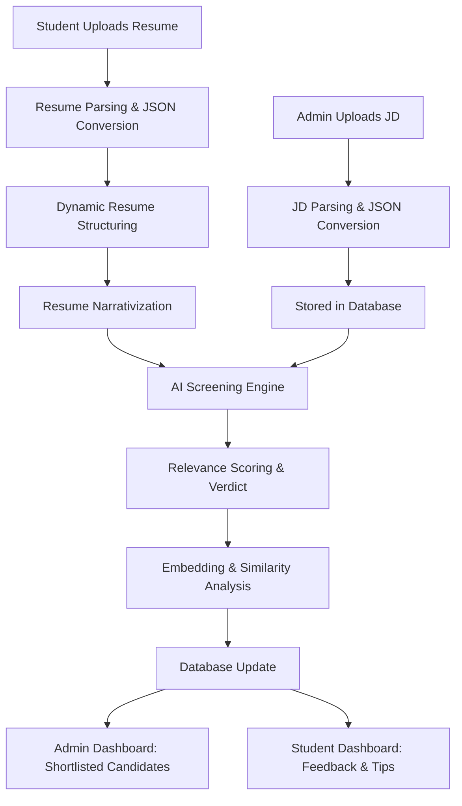

<div align="center">
  

  # Yuva Prashikshan

**AI That Knows Who Fits, Not Just Who Applies.**

An AI-driven platform to streamline the internship and government job allocation process — from application to final selection. The system features AI-based resume verification, skill extraction, job description matching, personalized assessments, and intelligent interviews, ensuring a fair, accessible, and scalable recruitment experience for all, including inclusive support for PwD candidates.


</div>

## 📌 Overview

This project is built under the theme **Automated Resume Relevance Check System**.

Every week, the placement team receives **thousands of job requirements** across Hyderabad, Bangalore, Pune, Delhi NCR and more. Each job attracts **hundreds or thousands of applications**.

Currently, resumes are checked **manually**, which causes:
- ⏳ **Delays** in shortlisting candidates
- ⚖️ **Inconsistency**, since recruiters interpret requirements differently  
- 🏋️ **High workload** for placement staff

Our system solves this by providing an **AI-powered, automated, and scalable resume relevance engine**.

---

## 🎯 Objectives

The system aims to:
- Automate **resume evaluation** against job descriptions
- Generate a **Relevance Score (0–100)**
- Classify candidates into **High / Medium / Low suitability**
- Highlight **missing skills, projects, and certifications**
- Provide **personalized improvement tips** to students
- Store results in a **dashboard** for recruiters

---

## 📂 Project Structure

```
edu/
├── public/
├── server/                  # Python backend (FastAPI services)
│   ├── .env
│   ├── attempt2.py
│   ├── cosinesim.py         # Cosine similarity analysis
│   ├── criteria_checker.py  # AI screening engine
│   ├── detailed_json.py
│   ├── embed.py             # Embedding generation & FAISS
│   ├── jd_parser_out.py     # JD parsing service (port 8001)
│   ├── parsePDF.py          # Resume parsing service (port 8000)
│   ├── structure_parser.py  # Resume structuring
│   ├── topK.py              # Final shortlisting logic
│   └── requirements.txt     # Python dependencies
│
├── src/                     # Next.js (React + TypeScript) frontend
│   └── app/
│       ├── Admindash/page.tsx        # Admin dashboard
│       ├── AdminJobs/[id]/page.tsx   # Job management
│       ├── Home/page.tsx             # Landing page
│       ├── Jobs/[id]/page.tsx        # Job details & application
│       ├── Jobs/page.tsx             # Job listings
│       └── Tips/page.tsx             # Student feedback & tips
│
├── package.json
└── globals.css
```

---

## 🏗️ System Architecture



---

## 👥 User Interfaces

### 🔹 Admin Panel
- Login as Admin
- Upload **Job Descriptions (JD)**
- View all JDs and their **status**  
- See **applications received** per JD
- Pause or close applications
- Get **final shortlist** of top candidates

### 🔹 Student Panel
- Login as Student
- Upload **Resume (PDF/DOCX)**
- See all active **Job Descriptions**
- Apply directly with uploaded resume
- After shortlisting, view:
  - ✅ Verdict (Accepted/Rejected)
  - 📊 Score & Sectional Scores
  - 📌 Missing Skills / Gaps
  - 💡 Improvement Tips

---

## ⚙️ Core Pipeline

### **Step 1: Job Description (JD) Processing** 
- Admin uploads a JD (PDF/DOCX)
- Extract text using `PyPDF2` / `python-docx`
- Parse text → Structured JSON with:
  - Company details
  - Required skills  
  - Good-to-have skills
  - Education / Experience criteria
- Store enriched JD JSON in database

### **Step 2: Resume Parsing (`parsePDF.py`)**
- Student uploads resume (PDF/DOCX/Scanned)
- Text extraction using `PyPDF2`, `docx`, or OCR
- Data Cleaning:
  - Remove noise, fix formatting
  - Normalize emails, phone numbers, LinkedIn, GitHub
- Section Detection:
  - Education, Experience, Projects, Skills, Summary
- Output → Raw JSON (`json1.json`)

### **Step 3: Dynamic Resume Structuring (`structure_parser.py`)**
- `json1.json` → passed to **AI**
- AI generates structured, **clean JSON** (`json2.json`) with arrays/objects
- Removes duplicates, validates schema
- Section statistics are generated (skills count, experience entries, etc.)

### **Step 4: Resume Narrativization**
- `json2.json` → passed to **AI** again
- Generates descriptive narrative (`json3.json`)
- Each section rewritten in **professional language**:
  - Adds duration for experience
  - Expands projects with roles & technologies
  - Summarizes skills and education

### **Step 5: Resume–JD Screening (`criteria_checker.py`)**
- Inputs: `json3.json` (resume) + JD JSON
- Each JD criterion scored **0–1** using AI
- Aggregate match score calculated
- Verdict: ✅ Accepted / ❌ Rejected
- Reasons & improvement tips generated
- Database updated
- If **Accepted → embed.py** runs to store embeddings

### **Step 6: Embedding & Similarity Matching (`embed.py`)**
- Embeddings generated with `all-mpnet-base-v2`
- Stored in **FAISS Index** for:
  - Section embeddings
  - Combined resume embedding  
- JD embeddings generated the same way
- Enables **cosine similarity search**

### **Step 7: Cosine Similarity Analysis (`cosinesim.py`)**
- Resume FAISS vs JD FAISS
- Section-level similarity calculated
- Weighted scoring:
  - **Experience** > Skills > Education
- Improvement tips auto-generated
- Database updated with:
  - Section scores
  - Total hireability %
  - Personalized tips

### **Step 8: Final Shortlisting (`topK.py`)**
- After applications close:
  - Top N candidates selected
  - If tie → higher **experience score** preferred
- Recruiter gets final list
- Students see results + tips

---

## ⚙️ Setup Instructions

### 1️⃣ Clone the repository

```bash
git clone https://github.com/SSARAWAGI05/YuvaPrashikshan
cd YouvaPrashikshan
```

### 2️⃣ Setup Environment

```bash
python -m venv venv
source venv/bin/activate   # Linux/Mac
venv\Scripts\activate      # Windows
```

### 3️⃣ Backend Setup (Python - FastAPI)

Install dependencies:

```bash
pip install -r requirements.txt
```

Setup environment variables in `server/.env`:

```
SUPABASE_URL=your_supabase_url
SUPABASE_KEY=your_supabase_key
HF_TOKEN=your_huggingface_token
GROQ_API_KEY=your_groq_api_key
USER_ID=example_user
JOB_ID=example_job
```

Run the **Resume Parser service** (port 8000):

```bash
uvicorn server.parsePDF:app --reload --port 8000
```

Run the **Job Description Parser service** (port 8001):

```bash
uvicorn server.jd_parser_out:app --reload --port 8001
```

### 4️⃣ Frontend Setup (Next.js - TypeScript)

Install dependencies:

```bash
npm install
```

Run the dev server:

```bash
npm run dev
```

Frontend will be available at **[http://localhost:3000](http://localhost:3000)**

---

## 🔑 Login Information

### 👨‍💼 Admin Login
- **Email**: `sarmahrishi04@gmail.com`
- **Password**: `abc123`

Use this to access the **Admin Dashboard**.

### 👤 User Login
- Users must **register (sign up)** first, then log in with their chosen email and password.

---

## 💻 Tech Stack

### **Core Processing**
- **Python** - Main backend language
- **PyMuPDF / pdfplumber** - Resume text extraction
- **python-docx** - DOCX parsing
- **OCR** - For scanned resumes
- **spaCy / NLTK** - NLP processing
- **Groq AI / GPT / HuggingFace** - LLM-powered analysis
- **SentenceTransformers** (`all-mpnet-base-v2`) - Embeddings
- **FAISS** - Similarity search

### **Backend & Storage**
- **FastAPI** - API for resume/JD processing
- **Supabase** - Database (applications, scores, metadata)

### **Frontend**
- **React** - UI library
- **Next.js (TypeScript)** - Full-stack framework
- **Tailwind CSS** - Styling

### **Other Tools**
- **Embeddings** - Semantic similarity
- **Cosine Similarity** - Matching algorithm
- **JSON parsing** - Structured data handling

---

## 📊 Example Output

### **For Recruiter:**

```json
{
  "candidate": "John Doe",
  "job_id": "JD_102",
  "relevance_score": 82,
  "verdict": "High",
  "missing_skills": ["Deep Learning", "Docker"],
  "section_scores": {
    "experience": 85,
    "skills": 78,
    "education": 90
  }
}
```

### **For Student:**

```
Verdict: ❌ Rejected  
Score: 58/100  

Reasons:  
- Missing Machine Learning projects  
- No cloud deployment experience  

Tips:  
- Add ML projects with real-world datasets  
- Learn basic cloud deployment (AWS/GCP)  
```

---

## 🚀 Workflow

1. **Backend Pipeline**
   - `parsePDF.py` → Parses resumes and extracts structured data
   - `jd_parser_out.py` → Parses job descriptions and extracts requirements
   - `structure_parser.py` → Converts raw resume data into structured JSON
   - `criteria_checker.py` → AI-powered resume-JD matching and scoring
   - `embed.py` → Generates embeddings and stores in FAISS index
   - `cosinesim.py` → Calculates similarity scores between resumes and JDs
   - `topK.py` → Final candidate ranking and shortlisting

2. **Frontend (Next.js)**
   - Built using Next.js (App Router)
   - Provides dashboards for **Admin** and **Users** to manage resumes, jobs, and match results
   - Real-time feedback and improvement suggestions for students

---

## 🚀 Future Enhancements

- Add **multilingual resume support**
- Use **RAG (Retrieval-Augmented Generation)** for smarter feedback
- Introduce **interview prep module** after shortlisting
- Analytics for placement team: trends, skill gaps, job role demand
- Mobile app for better accessibility

---

## 📌 Notes

- Make sure **Python ≥ 3.9** and **Node.js ≥ 18** are installed
- Run backend services **before** starting the frontend
- Update `.env` file in `server/` with API keys (required for AI services)
- The system uses AI models that may require internet connectivity for optimal performance

---

## 🙏 Acknowledgements

- **Innomatics Research Labs** for providing the challenge
- Open-source libraries: **FAISS, HuggingFace, LangChain**
- **Supabase** for database services
- **Groq AI** for fast LLM inference

---
